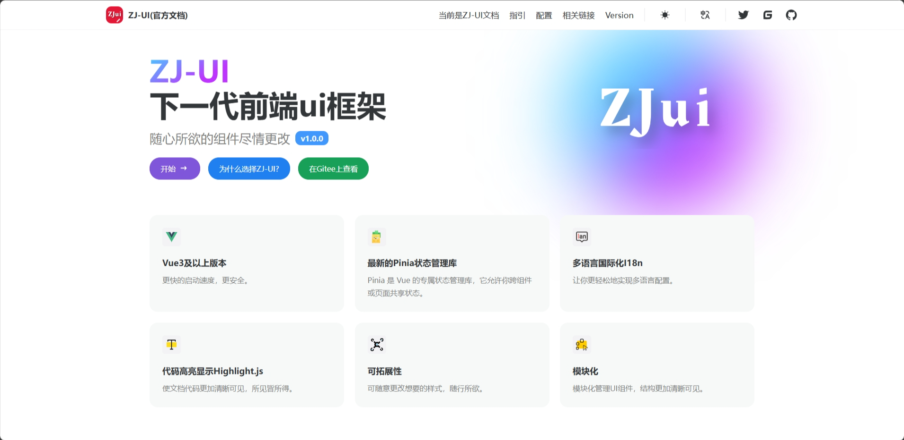
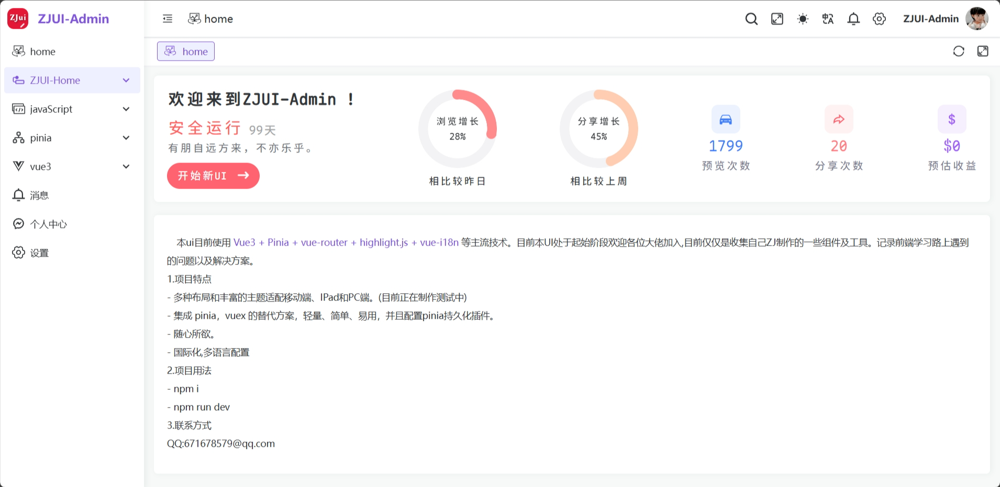
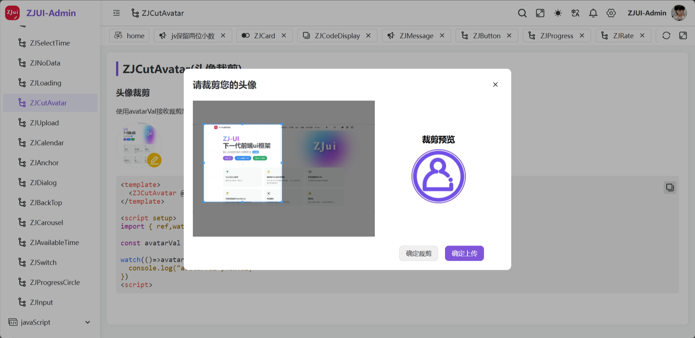
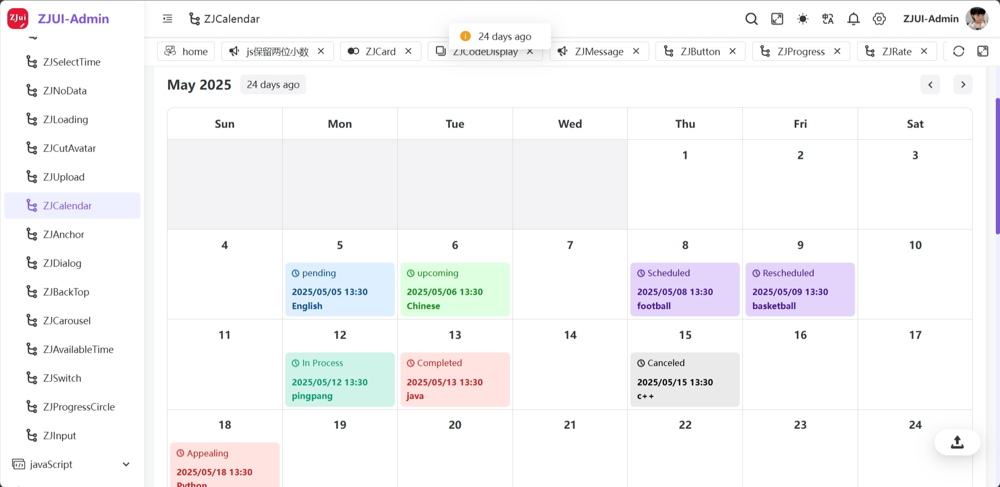
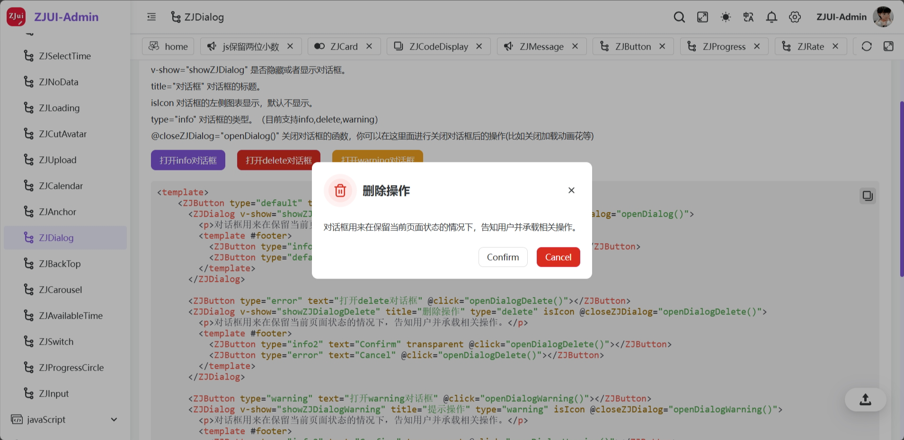
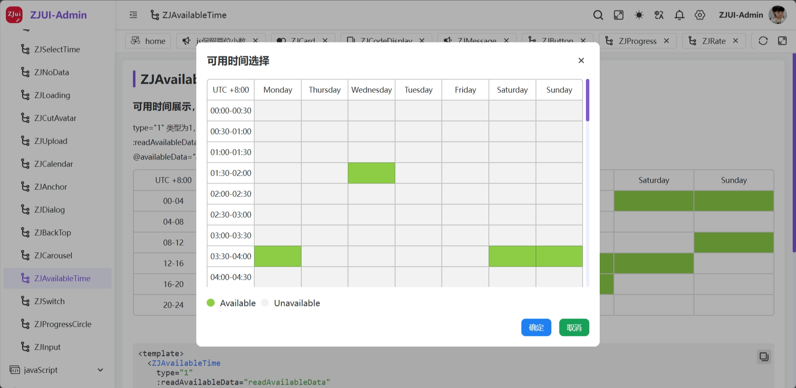
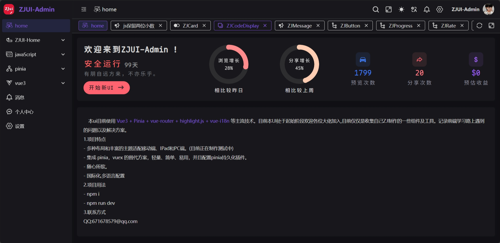
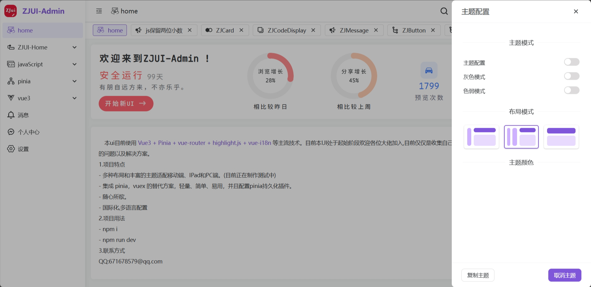

# ZJ-UI

<a href="https://zj-ui.netlify.app" target="_blank">

</a>


## 访问地址（Access address）
https://zj-ui.netlify.app

## 简介（ZH）
这是一个vue3的前端UI组件库,名字叫做（zhang jian-UI）这不仅仅是一个UI组件库，还是一个超好看的后台管理模板，支持主题，国际化等多种功能，与诸君共赏！

## Brief introduction（EN）
This is a vue3 front-end UI component library, the name is (zhang jian-UI) This is not only a UI component library, but also a super good-looking background management template, supporting themes, internationalization and other functions, and you can enjoy it!

## 项目源码

|         | 前端                                                         | 后端                                                         |
| :------ | :----------------------------------------------------------- | :----------------------------------------------------------- |
| Gitee   | [WERTYUZJ/zjui](https://gitee.com/WERTYUZJ/zjui.git) | [暂未开放](https://gitee.com/WERTYUZJ/zjui.git) |

## 系统截图

> [!TIP]
> 受篇幅长度及功能更新频率影响，下方仅为系统 **部分** 功能于 **2025年5月25日** 进行的截图，更多新增功能及细节请登录演示环境或 clone 代码到本地启动查看。

<table border="1" cellpadding="1" cellspacing="1" style="width: 500px">
  <tbody>
    <tr>
      <td></td>
      <td></td>
    </tr>
    <tr>
      <td></td>
      <td></td>
    </tr>
    <tr>
      <td></td>
      <td></td>
    </tr>
    <tr>
      <td></td>
      <td></td>
    </tr>
  </tbody>
</table>

## 开源协议
ZJ-UI 采用 MIT 许可证，您可以自由地使用、修改和分发软件，可以用于个人项目或商业项目，但禁止用于参加创新、创意类比赛。

## Project setup
```
npm install
```

### Compiles and hot-reloads for development
```
npm run serve
```

### Compiles and minifies for production
```
npm run build
```

### Lints and fixes files
```
npm run lint
```

### Customize configuration
See [Configuration Reference](https://cli.vuejs.org/config/).
